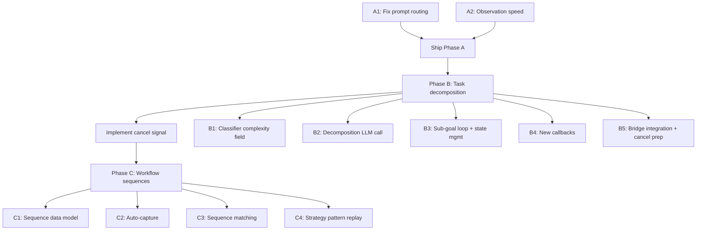

# Speed & Intelligence Improvements

## Enhancement Summary

**Deepened on:** 2026-03-11
**Research agents used:** TypeScript reviewer, Performance oracle, Architecture strategist, Pattern recognition specialist, Frontend races reviewer, Agent-native reviewer, Code simplicity reviewer, Best practices researcher, Security sentinel

### Key Improvements from Deepening
1. **Timeout chain correction validated** -- confirmed `PARTIAL_AX_TIMEOUT` is NOT on the observer hot path; plan targets the correct constants
2. **Type safety gaps identified** -- 10 critical TypeScript improvements for interfaces across all phases
3. **Performance: observation parallelization identified as highest-impact deferred item** -- could save 8-12s/step beyond the plan's 1-6s
4. **Frontend race conditions mapped** -- 11 race conditions identified, 3 critical (isAgentTyping flicker, dual-store progress, cancel no-op)
5. **V1 simplifications accepted** -- defer version-aware staleness (C5), network sequence sharing (C6), and dashboard sub-goal UI polish (B6) to reduce from 20 to 14 file changes
6. **Architecture: Strategy pattern recommended for Phase C** -- prevents execution path bifurcation as the system grows
7. **Security: skill injection prompt safety** -- frontmostApp name must be sanitized before inclusion in injected messages

### New Considerations Discovered
- `ax-tree.ts` timeout should resolve (not reject) to match the error-as-value pattern in `AXSnapshotResult`
- `ServerSubGoalProgress` must include `conversationId` (protocol contract)
- System prompt should be rebuilt per sub-goal (not once at loop start)
- Replay steps should NOT count toward 100-iteration ceiling
- Cancel (`AbortSignal`) must be implemented before Phase C ships
- Sub-goal transitions must NOT flow through `receiveMessage` (causes isAgentTyping flicker)

---

## Overview

Four interconnected improvements to make the agent dramatically faster and smarter, addressing the three P0/P1 issues from user testing session 2 where a simple "send email from Outlook" task took **8 minutes and only reached 40% completion** (10 iterations at 42.9s/iteration, hit the bridge's max limit of 10).

The improvements ship in three phases with clear dependency ordering:

| Phase | Scope | Key Outcome | Effort |
|-------|-------|-------------|--------|
| **A** | Prompt routing fix + observation speed | LLM uses skills correctly; 1-6s faster per step | ~2 hours |
| **B** | Task decomposition model | Sub-goal-driven progress; no fixed iteration cap | Medium |
| **C** | Workflow sequences with direct replay | Repeat tasks complete in ~20s instead of 8+ min | Larger |

**Speed impact projection** (see brainstorm: `docs/brainstorms/2026-03-11-session-2-speed-and-intelligence-improvements-brainstorm.md`):

| Scenario | Current | After | Improvement |
|----------|---------|-------|-------------|
| First-ever email task | 43s/step x 25 steps = 18 min | 37s/step x 15 steps = 9 min | 2x |
| Second email task (sequence exists) | Same 18 min | 4s/step x 6 steps = 24 sec | **45x** |
| Complex multi-app task (partial sequences) | 43s/step x 40+ steps = 29+ min | Mix: 4s (known) + 37s (unknown) = 5-8 min | 4-6x |

## Problem Statement

Three root causes identified in testing session 2 (see brainstorm):

1. **Observation pipeline bottleneck** (P0): 18-22s per iteration (~47% of total time). AX timeout set to 8s when most apps respond in <1s. Unconditional 800ms settle delay after every action.
2. **Contradictory prompt routing** (P0): System prompt tells LLM to "ALWAYS prefer skills" (`registry.ts:185`) but also says "Other desktop apps -> use vision/accessibility" (`prompt-builder.ts:37`). Outlook has a registered skill but the LLM ignores it.
3. **No learning from success** (P1): Agent explores from scratch every time. 30% of email task steps were wasted recovery/retry. Intelligence layer only engages after 3+ failures, which never triggers when individual steps succeed.
4. **Fixed iteration limits** (P1): Bridge defaults to 10 iterations (`bridge.ts:914,1066`), local agent to 25 (`agent-loop.ts:402`). Email task needed 20-25 iterations. Users see an iteration counter, not meaningful progress.

---

## Phase A: Prompt Routing Fix + Observation Speed (Ship First)

Phase A is standalone with no dependencies on B or C. Both improvements are low-risk, high-impact changes.

### A1: Fix Contradictory Prompt Routing

**Goal:** When an app has a registered skill, the LLM uses the skill instead of vision/accessibility.

**Current state:**
- `prompt-builder.ts:33-37` contains routing rules that contradict the skill registry's instructions
- `registry.ts:181-199` `buildSkillPromptSection()` injects "ALWAYS prefer these over UI automation when a skill exists"
- The LLM receives both instructions and typically follows the more specific routing rules, ignoring skills

**Changes:**

#### A1a: Fix routing rules in `prompt-builder.ts`

**File:** `local-agent/src/agent/prompt-builder.ts:33-37`

Replace the current routing section:
```
### When to use skills vs UI:
- Excel/Word file operations -> ALWAYS use skills (Layer 1)
- Opening files for the user to view -> use shell/exec with "open" command (Layer 2)
- Browser interactions -> use vision/accessibility (Layer 3-5)
- Other desktop apps -> use vision/accessibility (Layer 4-5)
```

With **dynamic** skill-aware routing (make conditional on whether skills are registered):
```typescript
const hasSkills = skillSection.length > 0;
const routingRules = hasSkills
  ? `### When to use skills vs UI:
- Apps with a registered skill (see FILE SKILLS above) -> ALWAYS use the skill (Layer 1)
- Opening files for the user to view -> use shell/exec with "open" command (Layer 2)
- Browser interactions -> use CDP (Layer 3), fall back to vision (Layer 5)
- Other desktop apps without skills -> use accessibility (Layer 4), fall back to vision (Layer 5)`
  : `### When to use skills vs UI:
- Opening files for the user to view -> use shell/exec with "open" command (Layer 2)
- Browser interactions -> use vision/accessibility (Layer 3-5)
- Other desktop apps -> use vision/accessibility (Layer 4-5)`;
```

> **Research insight (architecture review):** Making routing dynamic based on `buildSkillPromptSection()` output ensures the rules automatically update as skills are registered, rather than requiring manual text maintenance.

#### A1b: Proactive app-specific skill injection in `agent-loop.ts`

**File:** `local-agent/src/agent/agent-loop.ts` (between lines 448-452, the empty injection point)

After observation is collected and **after** the observation message is pushed to `conversationHistory` (line 452), check if the frontmost app has a registered skill. If so, inject a reminder:

```typescript
// === SKILL INJECTION (after BUILD MESSAGE, before DECIDE) ===
const appSkill = getSkillForApp(observation.frontmostApp);
if (appSkill) {
  const lastMsg = conversationHistory[conversationHistory.length - 1];
  const isAlreadyInjected = lastMsg?.role === 'user'
    && typeof lastMsg.content === 'string'
    && lastMsg.content.startsWith('SKILL AVAILABLE:');
  if (!isAlreadyInjected) {
    const cmds = appSkill.commands.map(c => c.name).join(', ');
    conversationHistory.push({
      role: 'user',
      content: `SKILL AVAILABLE: The app "${observation.frontmostApp}" has a registered skill. Use the ${observation.frontmostApp} skill commands (${cmds}) instead of vision/accessibility for this app.`,
    });
  }
}
```

> **Research insight (TypeScript review):** Inject AFTER `conversationHistory.push(userMessage)` at line 452, not before. This ensures the LLM sees the observation context before the skill hint. Injecting before means the hint has no visual context.

> **Research insight (security review):** The `observation.frontmostApp` value comes from JXA and is used directly in the injected message string. While JXA app names are system-controlled (not user-controlled), a malicious app with a crafted name could theoretically inject adversarial instructions. **Mitigation:** Sanitize the app name to alphanumeric + spaces only before inclusion. Severity: Low (requires a specially-named macOS app to be installed).

**Import needed:** `getSkillForApp` from `../skills/registry`

**Edge case — skill injection message accumulates across iterations:** The deduplication check above prevents this. Only injects if the previous message is NOT already a skill injection.

> **Research insight (TypeScript review):** Consider extracting this into a `buildSkillContext()` function to contain the registry coupling:
> ```typescript
> function buildSkillContext(observation: Observation): string | null {
>   const skill = getSkillForApp(observation.frontmostApp);
>   if (!skill) return null;
>   const cmds = skill.commands.map(c => c.name).join(', ');
>   return `SKILL AVAILABLE: ...`;
> }
> ```

### A2: Observation Speed Tweaks

**Goal:** Reduce per-step observation time by 1-6s.

**CRITICAL FINDING FROM RESEARCH:** The brainstorm identifies `PARTIAL_AX_TIMEOUT` in `context-collector.ts:29` (8s) as the target for reduction to 3s. However, **this timeout is not on the observer's critical path.** The observer calls `collectVisionContext` with `metadataOnly: true` (`observer.ts:142`), which skips the AX scan entirely (`context-collector.ts:225`). The observer's AX snapshot goes through a separate path: `observer.ts:228` -> `layer-router.ts:426` -> `ax-tree.ts:176` -> `macos-ax.ts:297 getInteractiveElements()`, which has only the `JXA_TIMEOUT_MS = 15_000` timeout (`macos-ax.ts:30`).

**Corrected changes:**

#### A2a: Reduce AX snapshot timeout

**Three constants to change:**

1. **`local-agent/src/executor/vision/context-collector.ts:29`** -- `PARTIAL_AX_TIMEOUT`: 8000 -> 3000
   - This affects the non-metadataOnly path (not currently on the observer's hot path, but used by other callers)

2. **`local-agent/src/executor/accessibility/macos-ax.ts:30`** -- `JXA_TIMEOUT_MS`: 15000 -> 4000
   - This is the **actual bottleneck** controlling the observer's AX snapshot path
   - Set to 4s (slightly above the 3s caller timeout) as a backstop

> **Research insight (performance review):** Most apps respond in <1s. Apps that take >3s are likely hanging. 15s was extremely generous. Reducing to 4s (as backstop for the 3s caller timeout) is safe.

3. **Add explicit timeout to `ax-tree.ts:getElementSnapshot()`:**
   - Wrap `getInteractiveElements` with a `Promise.race` using a 3s timeout
   - **Critical: resolve with error result, do not reject** -- matches the error-as-value pattern in `AXSnapshotResult`

**File:** `local-agent/src/executor/accessibility/ax-tree.ts:172-216`

```typescript
const AX_SNAPSHOT_TIMEOUT = 3000;

export async function getElementSnapshot(appName: string): Promise<AXSnapshotResult> {
  try {
    log(`[${timestamp()}] [ax-tree] Getting element snapshot for "${appName}"`);

    const timeoutPromise = new Promise<AXSnapshotResult>((resolve) =>
      setTimeout(
        () => resolve({ success: false, error: `Snapshot timed out after ${AX_SNAPSHOT_TIMEOUT}ms` }),
        AX_SNAPSHOT_TIMEOUT
      )
    );

    const snapshotPromise = (async (): Promise<AXSnapshotResult> => {
      const rawElements = await getInteractiveElements(appName);
      // ... existing element mapping logic ...
      return { success: true, app: appName, elements, count: elements.length };
    })();

    return Promise.race([snapshotPromise, timeoutPromise]);
  } catch (err) {
    const message = err instanceof Error ? err.message : String(err);
    logError(`[${timestamp()}] [ax-tree] Snapshot failed: ${message}`);
    return { success: false, error: message };
  }
}
```

> **Research insight (TypeScript review):** The timeout promise RESOLVES with `{ success: false }` instead of rejecting. This matches the existing codebase pattern where observer.ts "never throws" and functions return structured results.

> **Research insight (performance review):** Having JXA_TIMEOUT at 4s and the caller timeout at 3s is intentional. The 3s caller timeout wins, and the 4s JXA timeout is a backstop to clean up the subprocess.

#### A2b: Reduce settle delay

**File:** `local-agent/src/agent/agent-loop.ts:403`

Change default: `settleDelayMs = 800` -> `settleDelayMs = 400`

**Rationale** (see brainstorm): macOS animations complete in 200-350ms. 400ms is generous. This saves 400ms per iteration unconditionally.

> **Research insight (performance review):** An even better future approach is action-type-aware delays: 200ms for key_combo/type_text (no animation), 400ms for click (possible animation), 600ms for app launch/switch (window animation). Defer this to a follow-up.

#### A2c: Raise bridge iteration limit

**Files:** `server/src/bridge.ts:914` and `server/src/bridge.ts:1066`

Change both: `process.env.AGENT_MAX_ITERATIONS || '10'` -> `process.env.AGENT_MAX_ITERATIONS || '25'`

This aligns the bridge default with the local agent default.

### Phase A Acceptance Criteria

- [ ] **AC-A1:** When the frontmost app has a registered skill, the LLM uses the skill command instead of vision/accessibility on the first attempt
- [x] **AC-A2:** Skill injection message appears in conversation history only once per app per sequence of iterations (deduplication works)
- [x] **AC-A3:** When the frontmost app has NO registered skill, no injection occurs
- [x] **AC-A4:** The contradictory routing text in `prompt-builder.ts` is replaced with a dynamic skill-aware rule
- [x] **AC-A5:** AX snapshot completes within 3s or falls back to vision-only mode (no hang)
- [ ] **AC-A6:** Settle delay is 400ms with no screenshot quality regression on Outlook, Excel, Chrome, Finder
- [x] **AC-A7:** Bridge `AGENT_MAX_ITERATIONS` defaults to 25
- [ ] **AC-A8:** Manual test: "Send email from Outlook" uses Outlook skill commands on first iteration

### Phase A Files Modified

| File | Change |
|------|--------|
| `local-agent/src/agent/prompt-builder.ts` | Dynamic routing rules (lines 33-37) |
| `local-agent/src/agent/agent-loop.ts` | Skill injection (after line 452), settle delay default (line 403) |
| `local-agent/src/executor/accessibility/macos-ax.ts` | `JXA_TIMEOUT_MS` 15000 -> 4000 (line 30) |
| `local-agent/src/executor/accessibility/ax-tree.ts` | Add 3s resolve-on-timeout in `getElementSnapshot()` (line 176) |
| `local-agent/src/executor/vision/context-collector.ts` | `PARTIAL_AX_TIMEOUT` 8000 -> 3000 (line 29) |
| `server/src/bridge.ts` | `AGENT_MAX_ITERATIONS` default 10 -> 25 (lines 914, 1066) |

---

## Phase B: Task Decomposition Model

Phase B is the largest architectural change. It replaces the flat `for` loop in `agent-loop.ts:435` with a sub-goal-driven model.

### B1: Extend Haiku Classifier with Complexity Field

**File:** `server/src/bridge.ts` (classification logic around line 588)

Add a new `complexity` field to the classification output:

```typescript
interface ClassificationResult {
  // ... existing fields ...
  complexity: 'simple' | 'multi-step';
}
```

> **Research insight (TypeScript review):** Consider a third value `'unknown'` that triggers decomposition with a simplified prompt. This handles edge cases where the classifier is uncertain.

**Gating logic:** If `complexity === 'simple'`, skip decomposition and run the flat loop (25 iterations). If `complexity === 'multi-step'`, trigger the decomposition LLM call.

### B2: Decomposition LLM Call

**New file:** `local-agent/src/agent/task-decomposer.ts`

> **Research insight (agent-native review):** Design `task-decomposer.ts` as a **callable module** the agent can invoke mid-execution, not just a one-shot preprocessing step. If a sub-goal turns out to need further decomposition, the agent should be able to call the decomposer again.

**Output schema (with type safety improvements):**

```typescript
type SubGoalId = string & { readonly __brand: 'SubGoalId' };

function createSubGoalId(index: number): SubGoalId {
  return `sg_${index}` as SubGoalId;
}

interface SubGoal {
  id: SubGoalId;
  label: string;         // Human-readable, shown in dashboard
  description: string;   // Detailed instruction for the agent
  app: string;           // Target application
  sequenceRef?: string;  // Reference to a stored workflow sequence (Phase C)
}

// Use array position for ordering (drop the `order` field -- it duplicates array index)

type TaskDecompositionResult =
  | { ok: true; subGoals: SubGoal[] }
  | { ok: false; error: string; fallbackGoal: string };
```

> **Research insight (TypeScript review):** The discriminated union with `ok: true/false` matches the existing `ParsedResponse` pattern in `response-parser.ts`. The `fallbackGoal` field ensures the agent loop can gracefully degrade to flat-loop behavior when decomposition fails. Dropped `totalEstimatedSteps` -- the sub-goal count IS the progress denominator; an LLM-estimated step count would be inaccurate and misleading in the progress bar.

> **Research insight (TypeScript review):** Branded `SubGoalId` type prevents accidentally passing an element ref or command ID where a sub-goal ID is expected.

**Model choice:** Sonnet (configured via `ANTHROPIC_MODEL` in bridge.ts). Expected latency: ~5s.

> **Research insight (performance review):** The 5s decomposition cost breaks even within the FIRST iteration of any multi-step task (fewer wasted iterations + better stuck detection). For replay scenarios, ROI is enormous.

### B3: Sub-Goal Loop Architecture

**File:** `local-agent/src/agent/agent-loop.ts` -- major refactor of `runAgentLoop()`

Replace the flat `for` loop with a two-level structure:

```
NEW:
  decomposition = await decompose(goal) // or skip if simple
  for each subGoal in decomposition.subGoals:
    systemPrompt = buildSystemPrompt()  // Rebuild per sub-goal
    resetSubGoalState()
    callbacks.onSubGoalStart(subGoal, index, total)
    while (!subGoalComplete && !stuck && globalStep < GLOBAL_CEILING):
      observe -> decide -> act
      check if sub-goal is complete (from LLM response)
      check stuck detection
      globalStep++
    callbacks.onSubGoalComplete(subGoal, index, total)
  callbacks.onComplete(summary, globalStep)
```

> **Research insight (architecture review):** Rebuild `buildSystemPrompt()` at the start of each sub-goal, not once at loop start. Cost is negligible (synchronous string concatenation). Benefit: if a skill is discovered during sub-goal 1, sub-goal 3 sees it in the prompt.

**Key design decisions** (see brainstorm):

1. **No fixed per-sub-goal iteration budget.** The agent runs as long as it's making progress.
2. **Enhanced stuck detection** (simplified from original plan):
   - Existing checks: repeated actions (3 identical), same screen state (3 iterations)
   - **New check:** if 10+ iterations on same sub-goal without stuck detection triggering, inject a conversation message: "You have spent 10 iterations on this sub-goal. If you are stuck, report status: needs_help." This is zero additional API calls (conversation injection, not a separate LLM evaluation).
3. **Global safety ceiling of 100 iterations** across all sub-goals.

> **Research insight (simplicity review):** The original plan proposed a separate LLM call at 10+ iterations to ask "are you making progress?" This was identified as over-engineering. A conversation injection achieves the same nudge without the ~2-3s latency of an additional API call.

**Explicit state management between sub-goals:**

```typescript
interface SubGoalState {
  /** Resets per sub-goal */
  actionHistory: ActionRecord[];
  stuckSignals: Record<string, number>;
  consecutiveErrors: number;
}

interface GoalState {
  /** Carries forward across sub-goals */
  conversationHistory: ConversationMessage[];
  browserActive: boolean;
  commandCounter: number;
  discoveredApps: Set<string>;
  appFailures: Record<string, number>;
}
```

> **Research insight (TypeScript review):** Making the state split explicit in types prevents the inevitable bug where someone adds a new state variable and forgets to decide whether it resets or carries forward.

> **Research insight (performance review):** Consider summarizing conversation history at sub-goal boundaries. Replace raw accessibility trees and screenshot data from completed sub-goals with a 2-3 sentence structured summary. This keeps input tokens under ~15K regardless of total iterations, preventing LLM latency degradation.

**New `AgentLoopResult.outcome` variant:**

```typescript
outcome: 'complete' | 'partial_complete' | 'needs_help' | 'max_iterations' | 'error' | 'skill_generation_needed';
```

> **Research insight (TypeScript review):** `partial_complete` distinguishes "completed everything" from "completed 3 of 5 sub-goals then got stuck." The result should carry sub-goal completion status:
> ```typescript
> subGoalResults?: Array<{
>   subGoal: SubGoal;
>   outcome: 'complete' | 'stuck' | 'skipped' | 'not_started';
> }>;
> ```

### B4: New Callback Events

**File:** `local-agent/src/agent/agent-loop.ts` (extend existing `AgentLoopCallbacks`)

```typescript
interface AgentLoopCallbacks {
  // ... existing 8 callbacks preserved ...
  onDecomposition?: (subGoals: SubGoal[]) => void;
  onSubGoalStart?: (subGoal: SubGoal, index: number, total: number) => void;
  onSubGoalComplete?: (subGoal: SubGoal, index: number, total: number) => void;
  onSubGoalStuck?: (subGoal: SubGoal, index: number, total: number, strategy: 'retry' | 'skip' | 'help') => void;
  onSubGoalSkipped?: (subGoal: SubGoal, index: number, total: number, reason: string) => void;
}
```

> **Research insight (TypeScript review):** `onSubGoalStuck` now includes `index` and `total` for consistency with other sub-goal callbacks. Added `onSubGoalSkipped` for when the strategy is `'skip'`.

### B5: Bridge Server Integration

**File:** `server/src/bridge.ts`

```typescript
interface ServerSubGoalProgress {
  type: 'server_subgoal_progress';
  conversationId: string;   // Required by protocol contract
  subGoal: Pick<SubGoal, 'id' | 'label'>;
  index: number;
  total: number;
  status: 'pending' | 'active' | 'completed' | 'failed' | 'skipped';
}
```

> **Research insight (TypeScript review):** Added `conversationId` (every existing server-to-dashboard message includes it -- see `ServerChatResponse`, `ServerAgentProgress`). Added `'skipped'` and `'failed'` statuses. Used `Pick<SubGoal, ...>` instead of inline object type.

> **Critical (TypeScript review):** This type MUST be added to the `WebSocketMessage` union type in `shared/types.ts` (lines 757-773) for type-safe message discrimination.

**Decomposition timing:** After user confirms action preview -> decomposition call (~5s) -> first observation. Pipeline the first observation concurrently with decomposition if possible (observation doesn't depend on decomposition output).

**Cancel support (prerequisite for Phase C):** Add an `AbortSignal`-style mechanism:

```typescript
interface AgentLoopConfig {
  // ... existing fields ...
  signal?: { aborted: boolean };
}
```

Check `signal.aborted` at the top of each iteration. Set it from bridge.ts when receiving `dashboard_workflow_cancel`. This is preparation for Phase C where cancel during rapid replay is critical.

### B6: Dashboard Progress Display (Deferred -- ship basic version)

> **Research insight (simplicity review):** Defer the full dashboard sub-goal UI polish. Ship Phase B with the existing `server_agent_progress` messages carrying sub-goal context. The activity log already works. Full sub-goal boundary markers, progress bar overhaul, and "Planning task..." loading state are polish items for a follow-up.

**Minimum viable changes:**
- Route `server_subgoal_progress` messages in `message-router.ts`
- Replace hardcoded 77% in `WorkflowProgress.tsx` with real data

> **Research insight (frontend races review -- CRITICAL):** Sub-goal transitions must NOT flow through `receiveMessage()`. That function resets `isAgentTyping` to false and clears `agentLog`, causing flicker. Create a dedicated `completeSubGoal` action that archives log entries without resetting typing state. Only reset `isAgentTyping` when the entire agent loop completes.

> **Research insight (frontend races review):** `WorkflowProgress.tsx` reads from `workflowStore`. Sub-goal progress arrives in `chatStore`. These are TWO STORES for ONE progress concept. Decision: extend `server_workflow_progress` messages with sub-goal info so progress stays in one store.

> **Research insight (frontend races review):** On WebSocket reconnect, new sub-goal state must be reset alongside existing `resetTypingState()` call.

### Phase B Acceptance Criteria

- [ ] **AC-B1:** Multi-step tasks produce a decomposition with N sub-goals before the main loop starts
- [ ] **AC-B2:** Simple tasks bypass decomposition and run the existing loop behavior
- [ ] **AC-B3:** Dashboard shows sub-goal progress with real-time updates via WebSocket
- [ ] **AC-B4:** The agent does not exceed 100 iterations total across all sub-goals
- [ ] **AC-B5:** Enhanced stuck detection fires: conversation injection at 10+ iterations on same sub-goal
- [ ] **AC-B6:** `WorkflowProgress.tsx` hardcoded 77% is replaced with real data
- [ ] **AC-B7:** Conversation history carries forward between sub-goals; stuck detection resets
- [ ] **AC-B8:** Decomposition failure gracefully falls back to flat loop (no crash)
- [ ] **AC-B9:** System prompt rebuilds per sub-goal (newly discovered skills are visible)
- [ ] **AC-B10:** Manual test: "Send email from Outlook" decomposes into ~5 sub-goals

### Phase B Files Modified (Reduced from 8 to 5)

| File | Change |
|------|--------|
| `local-agent/src/agent/task-decomposer.ts` | **NEW** -- decomposition LLM call, SubGoal types, TaskDecompositionResult |
| `local-agent/src/agent/agent-loop.ts` | Sub-goal loop, callbacks, 100-iteration ceiling, stuck detection, state management, signal.aborted |
| `server/src/bridge.ts` | Classifier complexity field, new callbacks -> WebSocket, cancel signal |
| `shared/types.ts` | `SubGoal`, `SubGoalId`, `ServerSubGoalProgress`, WebSocketMessage union update |
| `dashboard/src/services/message-router.ts` | Route `server_subgoal_progress`, fix WorkflowProgress data source |

---

## Phase C: Workflow Sequences with Direct Replay

Phase C depends on Phase B's sub-goal structure. It is the highest-impact improvement for repeat tasks.

### C1: WorkflowSequence Data Model (Simplified)

**New file:** `local-agent/src/skills/workflow-sequences.ts` (separate from registry.json)

```typescript
interface WorkflowSequence {
  id: string;
  app: string;                     // e.g., "Microsoft Outlook"
  taskPattern: string;             // e.g., "send-email"
  parameterNames: readonly string[]; // e.g., ["to", "subject", "body"]
  capturedAt: string;              // ISO timestamp
  lastUsed: string;                // ISO timestamp, for LRU eviction
  steps: SequenceStep[];
}

interface SequenceStep {
  subGoalId: SubGoalId;
  layer: CommandLayer;             // From shared/types.ts, not string
  action: string;
  params: Record<string, unknown>; // Match AgentCommand.params type
  expectedScreenHint: string;      // Brief description for validation
}
```

> **Research insight (TypeScript review):** `layer` uses `CommandLayer` from `shared/types.ts` (not `string`) for exhaustive switch checking. `params` uses `Record<string, unknown>` to match `AgentCommand.params` -- accessibility params include numbers (coordinates) and arrays (menuPath). `parameterNames` is `readonly` to signal immutability.

> **Research insight (simplicity review):** Removed `appVersion` (validation fallback handles version changes), removed `subGoalLabels` (derivable from SubGoal structure).

**Storage:** Separate `workflow-sequences.json` file (not in `registry.json`).

> **Research insight (architecture review):** The registry already manages 3 data types. Adding a 4th creates semantic overload and file contention. Separate persistence file with its own `ensureLoaded()` and write-then-rename pattern.

**Eviction (simplified):** Cap at 20 total. Drop oldest by `capturedAt`. No per-app cap.

> **Research insight (simplicity review):** At V1 scale (1-5 testers, 3-5 apps), total sequence count will be well under 20. The dual-criteria eviction (50 total + 10 per app + LRU) is infrastructure for a scale that doesn't exist yet.

### C2: Auto-Capture After Successful Completion

**File:** `local-agent/src/agent/agent-loop.ts` (in the completion handler)

When `outcome: 'complete'`:
1. Extract successful action sequence from `conversationHistory` + sub-goal structure
2. Identify parameter values by matching against the original goal
3. Replace literals with `{{placeholder}}` tokens
4. Persist to `workflow-sequences.json`

### C3: Sequence Matching at Decomposition Time

**File:** `local-agent/src/agent/task-decomposer.ts`

Include stored sequence names in the decomposition prompt context. The LLM references them via `sequenceRef` on sub-goals. No separate matching algorithm needed.

> **Research insight (simplicity review):** This approach is justified complexity. Putting sequence names in the prompt leverages the LLM's language understanding for matching, avoiding a fragile string similarity algorithm.

### C4: Direct Replay Execution (Strategy Pattern)

> **Research insight (architecture review -- KEY RECOMMENDATION):** Design replay as a **strategy**, not a conditional branch. This prevents the execution path bifurcation that would make every future change require considering two code paths.

**Define a `SubGoalExecutor` interface:**

```typescript
interface SubGoalExecutor {
  executeStep(sendAndWait: SendAndWait, callbacks: AgentLoopCallbacks): Promise<StepResult>;
  isComplete(): boolean;
  onStepFailed(error: string): 'retry' | 'fallback' | 'abort';
}

class LLMDrivenExecutor implements SubGoalExecutor { /* existing observe-decide-act */ }
class ReplayExecutor implements SubGoalExecutor { /* stored action + Haiku validation */ }
```

The outer sub-goal loop selects the strategy based on `sequenceRef`. If `ReplayExecutor.onStepFailed()` returns `'fallback'`, the loop swaps to `LLMDrivenExecutor` for the remainder.

> **Research insight (agent-native review):** Consider a middle ground between full replay (no agent involvement) and full agent loop (43s/step). "Guided execution" would execute the stored action but with a light observation step (screenshot only, no AX tree) and a Haiku decision (not just validation but "does this match AND should I proceed?"). This preserves 60-70% of the speed gain while keeping the agent in the loop for judgment calls.

**Target speed:** ~3-4s per replayed step vs ~37-43s per full loop step.

**Iteration counting:** Replayed steps do NOT count toward the 100-iteration global ceiling.

> **Research insight (performance review + simplicity review):** Replay is cheap (~3s), deterministic, and validated. The ceiling exists to prevent runaway LLM costs, and replay has negligible cost. Track `fullLoopIterations` and `replayIterations` separately.

### C5: Version-Aware Staleness Handling -- DEFERRED

> **Research insight (simplicity review):** The Haiku validation screenshot check (C4) already handles version mismatches. If an app updated and a button moved, validation says NO and falls back to the full loop. Auto-recapture on completion happens unconditionally (C2). Version tagging adds 4 new code paths for behavior already covered by validation + fallback + recapture. **Defer to V2.**

### C6: Network Learning for Sequence Sharing -- DEFERRED

> **Research insight (simplicity review):** Ship local-only sequence capture first. Each agent captures its own sequences on first successful completion. The value of sharing is saving one first-run-per-agent. Validate replay works reliably before adding network complexity. **Defer to V2.**

### Prerequisite: Cancel Implementation

> **Research insight (frontend races review + architecture review -- BLOCKING):** The current `dashboard_workflow_cancel` handler (bridge.ts:1402-1409) logs and does nothing. With Phase C executing rapid sequential actions, a user must be able to stop the agent. Implement the `signal.aborted` mechanism from B5 and wire it to the cancel button before shipping Phase C.

> **Research insight (frontend races review):** On the dashboard side, provide immediate visual feedback when cancel is clicked (transition to "Cancelling..." state) even before the bridge confirms.

### Phase C Acceptance Criteria

- [ ] **AC-C1:** After `outcome:'complete'`, action sequence is persisted as a `WorkflowSequence`
- [ ] **AC-C2:** On subsequent task with matching sub-goal, stored sequence is replayed
- [ ] **AC-C3:** Each replayed step validated with screenshot + Haiku check; failure triggers fallback
- [ ] **AC-C4:** Replay speed is ~3-4s per step
- [ ] **AC-C5:** Sequences parameterized with `{{placeholder}}` tokens
- [ ] **AC-C6:** Sequences capped at 20 total with oldest-first eviction
- [ ] **AC-C7:** Cancel button stops replay within one step
- [ ] **AC-C8:** Manual test: Run "Send email from Outlook" twice; second run completes in <30s

### Phase C Files Modified (Reduced from 6 to 4)

| File | Change |
|------|--------|
| `local-agent/src/skills/workflow-sequences.ts` | **NEW** -- types, storage, separate persistence |
| `local-agent/src/agent/task-decomposer.ts` | Include sequences in decomposition context; extract parameters |
| `local-agent/src/agent/agent-loop.ts` | SubGoalExecutor strategy pattern; replay path; auto-capture on completion |
| `server/src/bridge.ts` | Wire cancel to `signal.aborted` |

---

## System-Wide Impact

### Interaction Graph

1. **Phase A skill injection** fires between observation and LLM call (`agent-loop.ts:452`). Phase B decomposition happens BEFORE the loop starts. These operate on different code paths. Skill injection still fires during replay fallback.

2. **Phase A timeout reduction** affects Phase C validation: faster AX snapshots mean validation screenshots may capture slightly earlier states. Acceptable -- Haiku validation is semantic ("does this look right?"), not pixel-perfect.

3. **Dashboard message types:** `server_subgoal_progress` (Phase B) and the existing `server_agent_progress` + `server_workflow_progress`. Route sub-goal progress through `server_workflow_progress` to keep one store as the canonical source.

### Error Propagation

| Error | Source | Propagation | Recovery |
|-------|--------|-------------|----------|
| Decomposition LLM call fails | Phase B | Caught in `task-decomposer.ts` | Fall back to flat loop (`ok: false`) |
| Sub-goal stuck detection fires | Phase B | Callback `onSubGoalStuck` | Conversation injection nudge; then ask user |
| Global 100-iteration ceiling hit | Phase B | Returns `outcome: 'max_iterations'` | Dashboard shows "Reached maximum steps" |
| Replay validation fails | Phase C | `ReplayExecutor.onStepFailed()` -> `'fallback'` | Swap to `LLMDrivenExecutor` for remaining steps |
| Sequence capture fails | Phase C | Logged, not propagated | Task completed; no sequence stored |
| Cancel requested | Phase B/C | `signal.aborted = true` | Clean exit with `outcome: 'cancelled'` |

> **Research insight (frontend races review):** Add client-side timeout in dashboard. If no response arrives within 45s, force-reset typing state with an error message. This handles cases where decomposition fails on the server and no response is ever sent.

### State Lifecycle Risks

- **`registry.json` vs `workflow-sequences.json`:** Separate files, separate persistence. No contention.
- **`buildSystemPrompt()` rebuilt per sub-goal:** Newly discovered skills are visible in subsequent sub-goals.
- **Partial completion:** If 3 of 5 sub-goals complete, returns `outcome: 'partial_complete'` with `subGoalResults`. No sequence captured (requires full `'complete'`).
- **Conversation history growth:** Mitigated by existing `pruneOldMessages()` with `RECENT_TURNS_TO_KEEP = 10`. Consider summarizing at sub-goal boundaries (compress completed sub-goal history into structured summary).

### Security Considerations

> **Research insight (security review):**

| Finding | Severity | Mitigation |
|---------|----------|------------|
| Skill injection uses `frontmostApp` in message string | Low | Sanitize app name (alphanumeric + spaces) |
| Workflow sequence params use `{{placeholder}}` substitution | Low | Validate placeholder names match `parameterNames` at capture time |
| `workflow-sequences.json` replayed without LLM oversight | Medium | Haiku validation screenshot check on every replayed step |
| Cancel no-op during rapid replay | High | `signal.aborted` mechanism (addressed in Phase B5) |

---

## Alternative Approaches Considered

(See brainstorm: `docs/brainstorms/2026-03-11-session-2-speed-and-intelligence-improvements-brainstorm.md`)

1. **Fixed high iteration ceiling (50-100):** Rejected. No progress visibility.
2. **Per-step LLM progress estimation:** Rejected. Cost without reliability.
3. **Hint injection instead of direct replay:** Rejected. 20-25s/step vs 3-4s/step.
4. **Observation parallelization:** Deferred. Highest-impact future optimization (~8-12s savings/step).
5. **Lower-res screenshots:** Deferred. Investigation needed.
6. **State machine instead of nested loop:** Considered. Nested loop preserves existing code, lower risk. State machine recommended if Phase D adds more execution modes.
7. **Compound JXA scripts:** Deferred. Consolidating 5 JXA calls into 1 could save ~0.8-1.5s/step.

> **Research insight (performance review):** Observation parallelization is the single highest-impact optimization available beyond this plan. Running screenshot first (~1s), then context + AX in parallel, could reduce observation from 18-22s to 3-5s. This is a Tier 2 item that should follow immediately after Phase A.

---

## Dependencies & Prerequisites



Phase A ships independently. Cancel signal is a prerequisite for Phase C.

---

## Risk Analysis & Mitigation

| Risk | Likelihood | Impact | Mitigation |
|------|-----------|--------|------------|
| Settle delay 400ms causes mid-transition screenshots | Low | Medium | Test on Outlook, Excel, Chrome, Finder; revert to 600ms if issues |
| Decomposition produces inconsistent sub-goals | Medium | High | Include stored sequence names as prompt anchors |
| Premature `outcome:'complete'` stores bad sequence | Medium | Medium | Validation during replay catches bad sequences; auto-replaced on next success |
| Haiku validation false positives/negatives | Low | Medium | Binary check is simple; wrong answers trigger safe fallback |
| 100-iteration ceiling too low | Low | Medium | Adjustable constant; replay doesn't count against it |
| Cancel no-op during rapid replay | N/A | **Critical** | `signal.aborted` mechanism required before Phase C ships |
| `isAgentTyping` flicker on sub-goal transitions | High | Medium | Dedicated `completeSubGoal` action; don't use `receiveMessage` |
| Two stores (workflowStore + chatStore) for progress | High | Medium | Route sub-goal progress through `server_workflow_progress` |
| Execution path bifurcation (replay vs AI) | Medium | High | Strategy pattern (`SubGoalExecutor` interface) |

---

## V1 Simplifications Applied

Based on the simplicity review, the following were deferred to reduce scope from 20 file changes to 14:

| Deferred Item | Rationale | When to Add |
|---------------|-----------|-------------|
| Version-aware staleness (C5) | Validation fallback already handles version changes | V2, after measuring version mismatch frequency |
| Network sequence sharing (C6) | Validate local replay works before adding network complexity | V2, after Phase C is stable |
| Full dashboard sub-goal UI polish (B6) | Basic progress works via existing messages | Follow-up after Phase B core ships |
| LLM progress check at 10+ iterations | Conversation injection achieves same effect without API call | If injection proves insufficient |
| Dual-criteria eviction (50 + 10/app + LRU) | Keep-last-20 is sufficient at V1 scale | When sequence count exceeds 20 |
| `appVersion` field on WorkflowSequence | Redundant with validation-based fallback | If version mismatches become a real problem |
| `subGoalLabels` on WorkflowSequence | Derivable from SubGoal structure | If denormalization proves needed for perf |

---

## Sources & References

### Origin

- **Brainstorm document:** [docs/brainstorms/2026-03-11-session-2-speed-and-intelligence-improvements-brainstorm.md](docs/brainstorms/2026-03-11-session-2-speed-and-intelligence-improvements-brainstorm.md) -- Key decisions carried forward: task decomposition replaces flat iteration counters, AX timeout/settle delay reductions, prompt routing fix with proactive skill injection, auto-captured parameterized workflow sequences with direct replay

### Internal References

- Testing session 2 data: `docs/brainstorms/2026-03-10-user-testing-session-2-issues.md`
- Fixes and findings doc: `docs/solutions/integration-issues/testing-sessions-1-and-2-fixes-and-findings.md`
- Debug panel solution: `docs/solutions/integration-issues/debug-panel-pipeline-logging-and-stuck-typing-state.md`
- Intelligence layer brief: `docs/agent/intelligence-layer/briefs/intelligence-layer-brief.md`

### Research Sources (from /deepen-plan)

- **TypeScript review:** 10 type safety improvements (branded SubGoalId, discriminated union result, CommandLayer on SequenceStep, conversationId on protocol messages, etc.)
- **Performance review:** Observation parallelization as Tier 2 priority; conversation history compression at sub-goal boundaries; replay steps excluded from iteration ceiling
- **Architecture review:** Strategy pattern for replay; separate persistence for sequences; system prompt rebuild per sub-goal; cancel as prerequisite
- **Frontend races review:** 11 race conditions identified; critical: isAgentTyping flicker, dual-store progress, cancel no-op
- **Agent-native review:** Decomposer as callable module; guided execution alternative to pure replay
- **Simplicity review:** 7 V1 simplifications reducing 20 files to 14
- **Security review:** Skill injection sanitization; template substitution safety; cancel as safety mechanism
- **Best practices research:** Sub-goal-scoped conversation history; element fingerprinting for version resilience (future)

### Key Code Locations

| File | Line(s) | What |
|------|---------|------|
| `local-agent/src/agent/agent-loop.ts` | 435 | Current flat for-loop |
| `local-agent/src/agent/agent-loop.ts` | 398-404 | Config defaults (maxIterations=25, settleDelayMs=800) |
| `local-agent/src/agent/agent-loop.ts` | 448-458 | Empty injection point |
| `local-agent/src/agent/agent-loop.ts` | 226-253 | Stuck detection |
| `local-agent/src/agent/agent-loop.ts` | 697 | Settle delay application |
| `local-agent/src/agent/prompt-builder.ts` | 33-37 | Contradictory routing rules |
| `local-agent/src/skills/registry.ts` | 181-199 | `buildSkillPromptSection()` |
| `local-agent/src/skills/registry.ts` | 156-163 | `getSkillForApp()` |
| `local-agent/src/executor/vision/context-collector.ts` | 29 | `PARTIAL_AX_TIMEOUT = 8000` |
| `local-agent/src/executor/accessibility/macos-ax.ts` | 30 | `JXA_TIMEOUT_MS = 15_000` |
| `local-agent/src/executor/accessibility/ax-tree.ts` | 172-216 | `getElementSnapshot()` (no timeout) |
| `server/src/bridge.ts` | 914, 1066 | `AGENT_MAX_ITERATIONS` default '10' |
| `server/src/bridge.ts` | 588 | Haiku classifier model |
| `server/src/bridge.ts` | 1402-1409 | Cancel handler (no-op) |
| `dashboard/src/components/Sidebar/WorkflowProgress.tsx` | 12 | Hardcoded 77% progress |
| `dashboard/src/stores/chatStore.ts` | 204-219 | `receiveMessage` resets `isAgentTyping` |
| `dashboard/src/services/message-router.ts` | 207-231 | Reconnect handler |
